# LouvorJA Multiplatform — Architecture Diagram

```mermaid
graph TD
    subgraph Frontend["FRONTEND (React 19 + TypeScript 5.8)"]
        subgraph Routes["Routes (TanStack Router)"]
            Root["__root.tsx\n(Root Layout)"]
            Dashboard["index.tsx\n(Dashboard)"]
            Hymnal["hymnal/\nindex, $hymnId"]
            Collections["collections/\nindex, $collectionId"]
            Presentations["presentations/\nindex, $presentationId"]
            Services["services/\nindex, $serviceId"]
            Operator["operator/\n(Operator Screen)"]
            Spotlight["spotlight\n(Cmd Palette)"]
            Projector["projector\n(Bare Route)"]
            Return["return\n(Bare Route)"]
        end

        subgraph Stores["Client State (Zustand)"]
            PresentationStore["usePresentationStore\nslides, activeSlide,\nprojectorOpen, activeService"]
            AudioStore["useAudioStore\nstatus, position,\nsyncPoints, playback mode"]
            DisplayStore["useDisplayStore\nprojectorOpen, returnOpen"]
            UIStore["useUIStore\nsidebar, modal states"]
            ThemeStore["useThemeStore\ntheme, language"]
            QueueStore["useQueueStore\nplaying queue"]
        end

        subgraph Hooks["Custom Hooks"]
            UseSlides["use-slides\n(Slide navigation)"]
            UseAudio["use-audio\n(Audio playback)"]
            UseHymnPlayback["use-hymn-playback\n(Playback coordination)"]
            UsePlaybackCoordinator["use-playback-coordinator\n(Sync + projection)"]
            UseMonitors["use-monitors\n(Monitor control)"]
            UseKeyboard["use-keyboard\n(Global shortcuts)"]
            UseBible["use-bible\n(Bible navigation)"]
        end

        subgraph Components["React Components"]
            Layout["Layout\n(Sidebar, Header, StatusBar)"]
            Music["Music\n(HymnCard, LyricsDisplay,\nAudioControls, AudioSyncEditor)"]
            Slides["Slides\n(SlideRenderer, SlideEditor,\nSlideList)"]
            ServicesComp["Services\n(ServiceItemList, ServiceTimeline)"]
            Display["Display\n(ProjectorControls, ProjectorView)"]
            UI["UI Primitives\n(Radix-based)"]
            CommandPalette["CommandPalette\n(cmdk-based search)"]
        end

        subgraph LibTS["Lib Layer"]
            TauriTS["tauri.ts\n(Typed invoke wrappers)"]
            QueriesTS["queries.ts\n(TanStack Query hooks)"]
            Bindings["bindings.ts\n(Auto-gen Specta types)"]
        end
    end

    subgraph TauriIPC["IPC Bridge (Tauri 2.9.4)"]
        Invoke["invoke\n(RPC requests)"]
        Emit["emit events\n(Tauri events)"]
        Listen["listen events\n(Subscriptions)"]
    end

    subgraph Backend["BACKEND (Rust + Tauri)"]
        subgraph Commands["Tauri Commands"]
            MusicCmd["music.rs"]
            CollectionsCmd["collections.rs"]
            SlidesCmd["slides.rs"]
            BibleCmd["bible.rs"]
            LiturgyCmd["liturgy.rs"]
            DisplayCmd["display.rs"]
            AudioCmd["audio.rs"]
            SettingsCmd["settings.rs"]
            UtilityCmd["utility.rs\n(video, timer, lottery)"]
            LegacyFetchCmd["legacy_fetch.rs"]
            UpdaterCmd["updater.rs"]
        end

        subgraph AppState["AppState (Mutex-protected)"]
            DB["db: ConnectionPool\n(rusqlite)"]
            CurrentSlide["current_slide: SlideContent"]
            ProjectorOpen["projector_open: bool"]
            OverlayState["overlay: OverlayRuntimeState"]
        end

        subgraph AudioState["AudioState (Mutex)"]
            AudioPlayer["AudioPlayer (rodio)\nstatus, position, duration"]
        end

        subgraph DBLayer["Database Layer"]
            MusicQ["music queries"]
            CollQ["collections queries"]
            SlidesQ["slides queries"]
            BibleQ["bible queries"]
            LiturgyQ["liturgy queries"]
            SettingsQ["settings queries"]
            rusqlite["rusqlite (SQLite)"]
            Migrations["Migrations v1-13"]
        end

        subgraph Modules["Modules"]
            AudioMod["audio/\n(rodio player, sync engine)"]
            DisplayMod["display/\n(monitors, WebviewWindowBuilder,\noverlay engine)"]
            StreamingMod["streaming/\n(SSE TcpListener,\nHTML templates)"]
            ArchiveMod["archive/\n(.slja reader/writer,\nPPTX importer)"]
            VideoMod["video/\n(metadata, managed paths)"]
        end
    end

    subgraph Events["Tauri Events"]
        SlideChanged["slide-changed"]
        OverlayChanged["overlay-changed"]
        SlideClear["slide-cleared"]
        GlobalShortcutEv["global-shortcut"]
        MonitorHotplug["monitor-hotplug"]
        VideoCopy["video-copy-complete/error"]
    end

    Root -->|renders| Dashboard & Hymnal & Collections & Presentations & Services & Operator & Projector & Return & Spotlight
    Hymnal -->|uses| AudioStore & PresentationStore
    Presentations -->|uses| PresentationStore
    Operator -->|uses| PresentationStore & DisplayStore
    Music -->|uses| UseAudio & UseHymnPlayback
    Slides -->|uses| UseSlides
    Display -->|uses| UseMonitors
    Hooks -->|reads/writes| Stores
    Stores -->|invalidates| QueriesTS
    QueriesTS -->|call| TauriTS
    TauriTS -->|RPC| Invoke
    Invoke -->|IPC bridge| Commands
    Commands -->|query/mutate| DBLayer
    DBLayer -->|SQL| rusqlite
    Commands -->|manage| AppState
    Commands -->|control| AudioMod & DisplayMod & StreamingMod & ArchiveMod & VideoMod
    AudioMod -->|playback| AudioState
    DisplayMod -->|window creation| ProjectorOpen
    Commands -->|emit| Emit
    Emit -->|broadcasts| SlideChanged & OverlayChanged & SlideClear & GlobalShortcutEv & MonitorHotplug & VideoCopy
    Listen -->|subscribes| SlideChanged & OverlayChanged & SlideClear & GlobalShortcutEv & MonitorHotplug
    Projector -->|listens| SlideChanged & OverlayChanged & SlideClear
    Return -->|listens| SlideChanged
    UseKeyboard -->|listens| GlobalShortcutEv
    DisplayStore -->|listens| MonitorHotplug
    ThemeStore -->|listens| Events
    CommandPalette -->|call| TauriTS

    classDef frontendBox fill:#e1f5fe,stroke:#01579b,stroke-width:2px,color:#000
    classDef backendBox fill:#f3e5f5,stroke:#4a148c,stroke-width:2px,color:#000
    classDef stateBox fill:#fff3e0,stroke:#e65100,stroke-width:2px,color:#000
    classDef storageBox fill:#e8f5e9,stroke:#1b5e20,stroke-width:2px,color:#000
    classDef eventBox fill:#fce4ec,stroke:#880e4f,stroke-width:1px,color:#000
```

## Key Data Flows

### Hymn Playback
User clicks hymn → `playHymn()` hook → `audioPlay()` command → rodio starts → emit `audio-status` events → `useAudioStore` updates position → sync-to-slide logic auto-projects stanzas

### Presentation Projection
User clicks slide → `setCurrentSlide()` command → emits `slide-changed` → projector window listens → renders slide

### Service Playback
User clicks service item → set index in `usePresentationStore` → `useEffect` auto-projects item via `setCurrentSlide()` → emit `slide-changed` → projector renders

## Architecture Notes

- **Dual-window IPC**: Projector and Return are bare React routes in separate Tauri WebviewWindows. They receive state via Tauri events (`slide-changed`, `overlay-changed`), not Zustand — state does not cross window boundaries.
- **Layered state**: TanStack Query owns server/persisted state (hymns, slides, services); Zustand owns ephemeral UI state (what's projected, audio position).
- **IPC non-blocking contract**: Every long-running Rust command returns `Ok(())` immediately and spawns `std::thread::spawn` — required on Windows to prevent freezing the IPC bridge.
