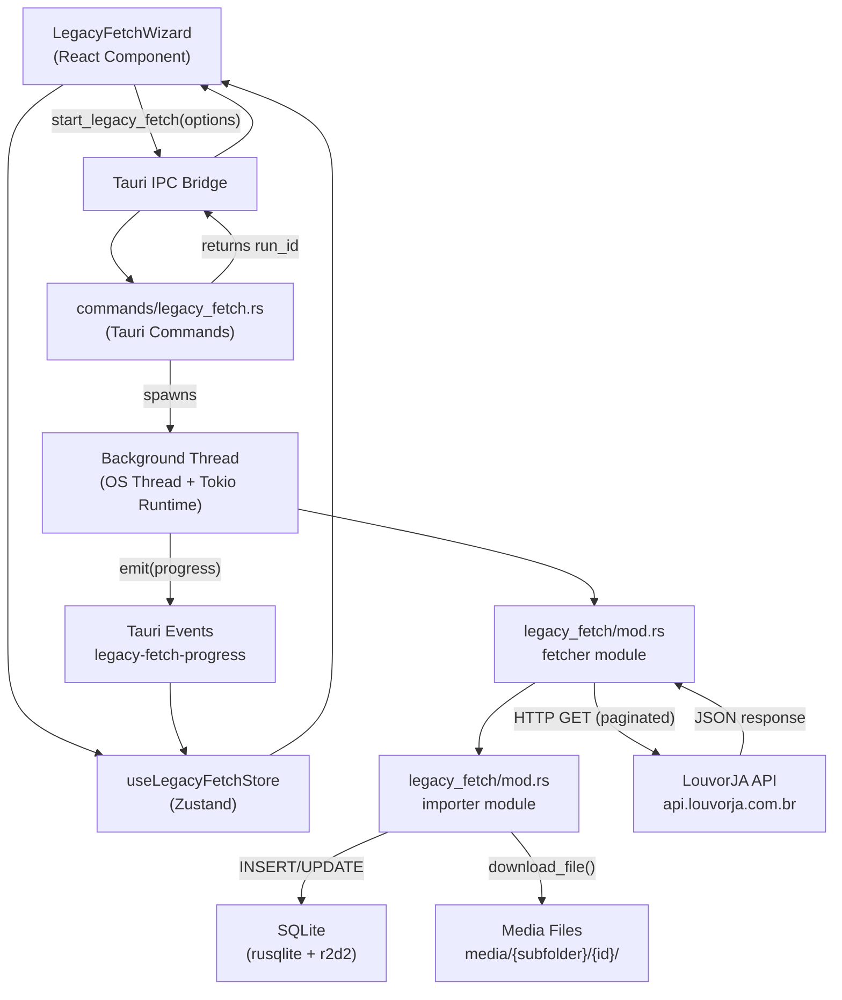
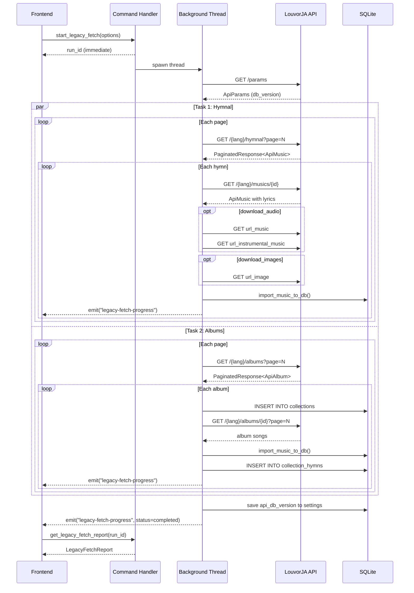
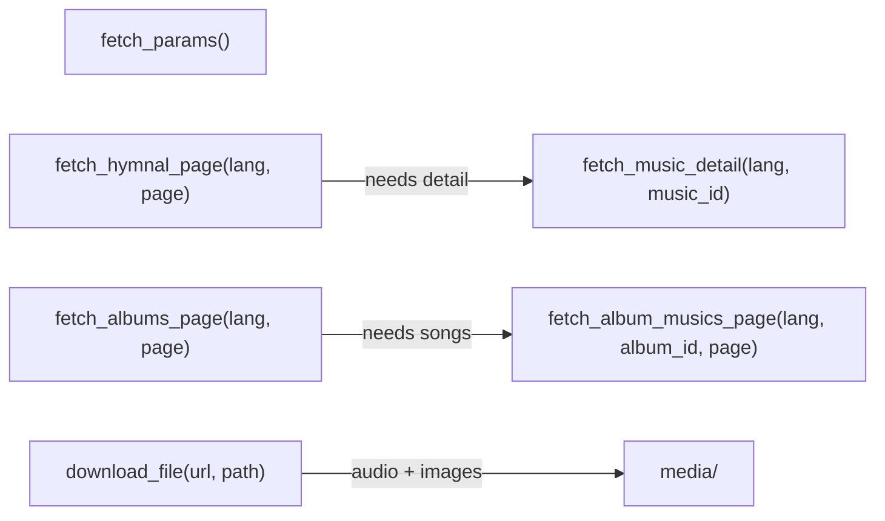
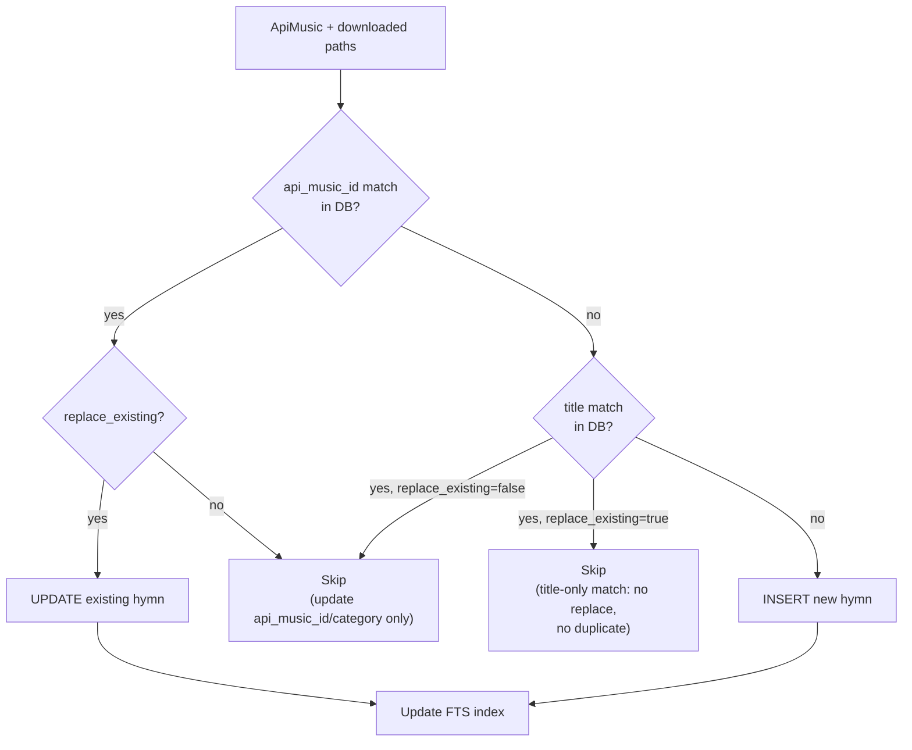
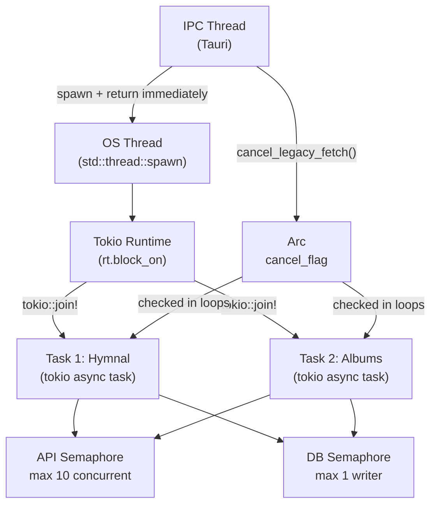

# Legacy Fetcher Architecture

The Legacy Fetcher imports hymns, albums, and media files from the LouvorJA API (`api.louvorja.com.br`) into the local SQLite database. It runs as a cancellable background operation with real-time progress reporting.

---

## High-Level Architecture



---

## Layer 1: Frontend

### Components

| File | Purpose |
|------|---------|
| `src/components/migration/legacy-fetch-wizard.tsx` | Wizard UI: language picker, options, progress card, final report |
| `src/stores/legacy-fetch-store.ts` | Zustand store for `runId`, `progress`, `report`, `isCancelling` |
| `src/types/legacy-fetch.ts` | Re-exports generated types from `bindings.ts` |

### State Shape

```ts
useLegacyFetchStore: {
  runId: string | null
  progress: LegacyFetchProgress | null
  report: LegacyFetchReport | null
  isCancelling: boolean
}
```

### User Options

```ts
LegacyFetchOptions {
  language: 'pt' | 'en' | 'es'
  replace_existing: boolean   // overwrite hymns with same title
  download_audio: boolean     // download vocal + karaoke audio files
  download_images: boolean    // download cover images
}
```

### Event Listener Pattern

The component listens to Tauri events for real-time progress:

```ts
const unlisten = await listen('legacy-fetch-progress', (event) => {
  const progress = event.payload as LegacyFetchProgressEvent;
  useLegacyFetchStore.getState().setProgress(progress);

  if (progress.status === 'completed' || progress.status === 'failed') {
    const report = await getLegacyFetchReport(progress.run_id);
    useLegacyFetchStore.getState().setReport(report);
  }
});
```

---

## Layer 2: Tauri Command Bridge

### Commands

| Command | Parameters | Returns | Notes |
|---------|-----------|---------|-------|
| `start_legacy_fetch` | `LegacyFetchOptions`, `AppHandle`, `AppState` | `String` (run_id) | Returns immediately; spawns background thread |
| `get_legacy_fetch_progress` | `run_id: String`, `AppState` | `LegacyFetchProgress` | Poll current state |
| `cancel_legacy_fetch` | `run_id: String`, `AppState` | `()` | Sets `AtomicBool` cancel flag |
| `get_legacy_fetch_report` | `run_id: String`, `AppState` | `Option<LegacyFetchReport>` | Available after completion |
| `fetch_legacy_params` | — | `ApiParams` | API metadata (version, download URLs) |
| `check_db_version` | `AppState` | `DbVersionCheckResult` | Detect API data updates |
| `restore_hymn_from_api` | `hymn_id: i64`, `language` | `()` | Re-download a single hymn |
| `restore_album_from_api` | `collection_id: i64`, `language` | `()` | Re-download an album |

### Run State (Rust)

```rust
pub struct LegacyFetchRunState {
    progress: LegacyFetchProgress,        // Current snapshot
    report: Option<LegacyFetchReport>,    // Set on completion
    cancel_flag: Arc<AtomicBool>,         // Shared with background thread
}

pub struct LegacyFetchRuntimeState {
    active_run_id: Option<String>,
    runs: HashMap<String, LegacyFetchRunState>,
}
// Stored in AppState as: legacy_fetch: Mutex<LegacyFetchRuntimeState>
```

### Thread Spawn Pattern

```rust
#[tauri::command]
pub fn start_legacy_fetch(options: LegacyFetchOptions, app: AppHandle, state: State<AppState>) -> Result<String, AppError> {
    let run_id = new_run_id();
    // Store initial run state in AppState
    // ...

    let app_clone = app.clone();
    std::thread::spawn(move || {
        let rt = tokio::runtime::Runtime::new().unwrap();
        rt.block_on(run_legacy_fetch_background(app_clone, run_id, options, cancel_flag));
    });

    Ok(run_id) // Return immediately — doesn't block IPC
}
```

---

## Layer 3: Background Execution

### Full Operation Sequence



### Progress Data

```ts
LegacyFetchProgress {
  run_id: string
  step: 'connecting' | 'fetching' | 'importing' | 'downloading' | 'done'
  status: 'running' | 'completed' | 'failed' | 'cancelled'
  percent: number           // 0.0 to 100.0
  message: string | null
  items_total: number
  items_processed: number
  sub_tasks: LegacyFetchSubTask[]
}
```

### Final Report

```ts
LegacyFetchReport {
  run_id: string
  hymns_fetched: number
  hymns_imported: number
  hymns_skipped: number
  albums_fetched: number
  albums_created: number
  collection_hymns_linked: number
  audio_downloaded: number
  images_downloaded: number
  errors: LegacyFetchError[]
  duration_ms: number
}
```

---

## Layer 4: Data Fetching & Import

### API Fetcher (`fetcher` module)



**Key design choices:**
- Custom deserializers handle API quirks (`"1"` vs `1` vs `""` vs `null`)
- `fetch_album_musics_page` tries multiple JSON shapes (array, object, wrapped)
- `download_file` enforces 50 MB size limit before and after download

### API Response Types

```rust
ApiMusic {
    id_music: i64,
    name: String,
    track: Option<i64>,
    url_music: Option<String>,              // vocal audio
    url_instrumental_music: Option<String>, // karaoke audio
    url_image: Option<String>,
    lyrics: Vec<ApiLyric>,                  // only in detail response
}

ApiLyric {
    id_lyric: i64,
    lyric: String,
    order: i64,
    time: Option<String>,                   // vocal sync "00:00:03"
    instrumental_time: Option<String>,      // karaoke sync
    show_slide: Option<i64>,
}

ApiAlbum {
    id_album: i64,
    name: String,
    url_image: Option<String>,
    musics: Vec<ApiMusic>,
}
```

### Data Importer (`importer` module)



> `replace_existing` only applies to records matched by `api_music_id`. A title-only match is
> never overwritten — the item is skipped to prevent replacing unrelated hymns that share a name.

**Key functions:**

```rust
// Convert lyrics array to plain text (stanzas separated by \n\n)
pub fn lyrics_to_text(lyrics: &[ApiLyric]) -> String

// Convert lyrics to JSON with sync timing
pub fn lyrics_to_sync_json(lyrics: &[ApiLyric]) -> Option<String>
// Output: [{ lyric, order, time, instrumental_time }, ...]

// Download and save a media file
pub async fn download_media_file(
    url: Option<&String>,
    media_dir: &Path,
    subfolder: &str,     // "audio" | "playback" | "images" | "album_covers"
    music_id: i64,
    default_ext: &str,
) -> Option<String>      // returns relative path e.g. "media/audio/42/hymn.mp3"

// Core DB insertion with deduplication
pub fn import_music_to_db(
    conn: &Connection,
    music: &ApiMusic,
    audio_path: Option<&str>,
    playback_path: Option<&str>,
    cover_path: Option<&str>,
    replace_existing: bool,
    album_name: Option<&str>,
    api_music_id: Option<i64>,
    category: Option<&str>,
) -> Result<(bool, Option<i64>), AppError>
// Returns: (was_imported, hymn_id)
```

---

## Database Schema

### Migrations

| Migration | Change |
|-----------|--------|
| `migrate_v14` | Add `legacy_file_id INTEGER` to `hymns` |
| `migrate_v15` | Add `playback_path TEXT`, `lyrics_sync TEXT` to `hymns` |
| `migrate_v16` | Add `api_music_id INTEGER` to `hymns`; add `source_type TEXT`, `api_album_id INTEGER` to `collections`; create `collection_hymns` join table |
| `migrate_v18` | Backfill `category` for API hymns (`'hymnal'` or `'album'`) |

### Relevant Tables

```sql
-- Hymns with API tracking columns
CREATE TABLE hymns (
    id              INTEGER PRIMARY KEY AUTOINCREMENT,
    number          INTEGER,
    title           TEXT NOT NULL,
    author          TEXT,
    album           TEXT,
    lyrics          TEXT,           -- plain text, stanzas separated by \n\n
    audio_path      TEXT,           -- relative: media/audio/{id}/...
    playback_path   TEXT,           -- relative: media/playback/{id}/...
    cover_path      TEXT,           -- relative: media/images/{id}/...
    lyrics_sync     TEXT,           -- JSON sync timing array
    api_music_id    INTEGER,        -- API source ID (deduplication key)
    category        TEXT,           -- 'hymnal' | 'album'
    ...
);

-- Album collections from API
CREATE TABLE collections (
    id           INTEGER PRIMARY KEY AUTOINCREMENT,
    name         TEXT NOT NULL,
    source_type  TEXT DEFAULT 'file',  -- 'file' | 'api'
    api_album_id INTEGER,
    ...
);

-- Many-to-many: albums <-> hymns
CREATE TABLE collection_hymns (
    id            INTEGER PRIMARY KEY AUTOINCREMENT,
    collection_id INTEGER NOT NULL REFERENCES collections(id) ON DELETE CASCADE,
    hymn_id       INTEGER NOT NULL REFERENCES hymns(id) ON DELETE CASCADE,
    item_order    INTEGER DEFAULT 0,
    UNIQUE(collection_id, hymn_id)
);
```

---

## Concurrency Model



**Key properties:**
- IPC handler never blocks — returns `run_id` immediately
- `Arc<AtomicBool>` cancel flag is lock-free (checked with `Ordering::SeqCst`)
- API semaphore: max 10 concurrent HTTP requests
- DB semaphore: max 1 writer (SQLite WAL safe but avoids contention)
- Cancellation is always graceful — never interrupts mid-write

---

## Smart Resume

When `replace_existing = false`, the background task can skip already-imported hymns:

1. Query `MAX(hymns.number)` from DB at start
2. Calculate starting page: `(last_hymn_number / 15).max(0) + 1`
3. Use `INSERT OR IGNORE` — DB-level deduplication on `(api_music_id)` or `(title)`

---

## Error Handling

```ts
LegacyFetchError {
  item_type: string   // 'hymn' | 'album' | 'album_song' | 'fetch_hymns'
  item_id: string | null
  message: string
}
```

- Per-item failures do not stop the operation — errors accumulate in the report
- `"NO_CONTENT_AVAILABLE:{lang}"` sentinel: API has no content for that language
- 50 MB download guard prevents runaway writes
- SQLite errors during import stop the operation but commit partial results

---

## Key Files

| File | Lines | Role |
|------|-------|------|
| `src-tauri/src/commands/legacy_fetch.rs` | ~890 | Tauri commands, run state, thread spawn, progress emission |
| `src-tauri/src/legacy_fetch/mod.rs` | ~1026 | API fetching, media download, DB import, dedup logic |
| `src-tauri/src/db/migrations.rs` | ~744 | Schema: `api_music_id`, `lyrics_sync`, `collection_hymns`, etc. |
| `src-tauri/src/state.rs` | ~237 | `AppState.legacy_fetch: Mutex<LegacyFetchRuntimeState>` |
| `src/components/migration/legacy-fetch-wizard.tsx` | ~382 | UI wizard + progress card |
| `src/stores/legacy-fetch-store.ts` | ~29 | Zustand: `runId`, `progress`, `report`, `isCancelling` |
| `src/types/legacy-fetch.ts` | ~16 | Re-exports from `bindings.ts` |
