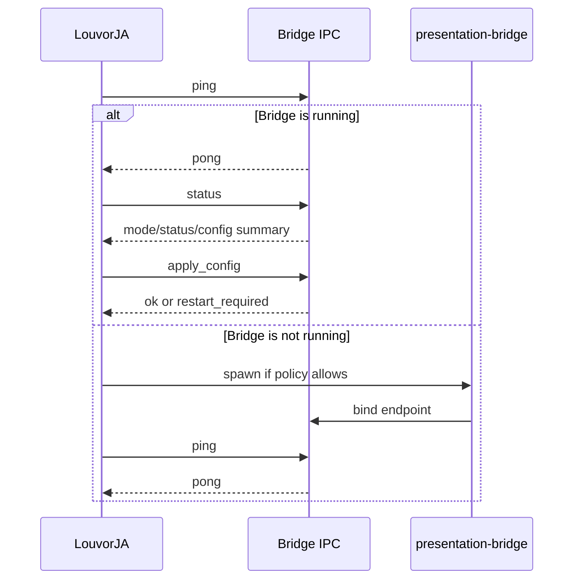

# Presentation Bridge Lifecycle and IPC Design

**Date:** 2026-03-07
**Status:** Draft for implementation
**Scope:** Runtime ownership, lifecycle modes, startup/shutdown behavior, IPC contract, and configuration authority for `presentation-bridge`

## Purpose

Define `presentation-bridge` as a standalone runtime responsible for:

- global shortcut capture for external slide control,
- external presentation automation,
- surviving independently from LouvorJA when configured,
- exposing a small local IPC interface so LouvorJA can detect, configure, and supervise it.

This document does **not** define the PowerPoint adapter internals. It defines the process contract around that adapter.

## Non-Goals

- Generic key injection into arbitrary unfocused windows
- Remote/network control
- Multi-user shared bridge service
- Linux Wayland support
- Raw HID device support beyond keyboard-like clickers

## Components

### LouvorJA Main App

Responsibilities:

- render settings UI,
- persist bridge configuration,
- register/unregister bridge OS autostart,
- probe for bridge presence,
- attach to an already-running bridge,
- start the bridge when policy allows,
- stop the bridge only when bridge mode is managed.

### `presentation-bridge`

Responsibilities:

- run as a singleton process,
- load bridge config from disk,
- register global next/previous shortcuts,
- execute external presentation commands,
- expose status and control over local IPC,
- exit with the parent only in managed mode.

## Ownership Rules

`presentation-bridge` is the **only** owner of external presentation next/previous shortcuts.

LouvorJA may continue owning:

- its existing local shortcuts,
- unrelated global shortcuts such as app utilities.

LouvorJA must **not** register the bridge-owned next/previous shortcuts, or shortcut conflicts will occur.

## Configuration Authority

LouvorJA is the source of truth for bridge configuration editing. The bridge is the source of truth for bridge runtime state.

### Persisted Config Keys

- `presentation.bridge.enabled`
- `presentation.bridge.startWithOs`
- `presentation.bridge.targetApp`
- `presentation.bridge.shortcutNext`
- `presentation.bridge.shortcutPrev`

### Config Storage

Use a dedicated bridge config file under app data rather than coupling bridge startup to the main app database.

Reason:

- the bridge must be able to start before LouvorJA,
- the bridge should not require the full app runtime to read configuration,
- config reload remains simple.

## Lifecycle Modes

## Managed Mode

Enabled when:

- `presentation.bridge.enabled = true`
- `presentation.bridge.startWithOs = false`

Semantics:

- LouvorJA starts the bridge if missing.
- LouvorJA is the active supervisor.
- The bridge exits when LouvorJA exits, disconnects, or stops heartbeating.
- LouvorJA may explicitly send `shutdown`.

Use case:

- user wants the feature only while LouvorJA is open.

## Independent Mode

Enabled when:

- `presentation.bridge.enabled = true`
- `presentation.bridge.startWithOs = true`

Semantics:

- the bridge may start on OS login without LouvorJA,
- the bridge may already be running before LouvorJA opens,
- LouvorJA must attach if found,
- LouvorJA exit must not terminate the bridge.

Use case:

- user wants PowerPoint/clicker control available even with LouvorJA closed.

## Startup Semantics

## Bridge Startup

On launch, the bridge must:

1. acquire singleton ownership,
2. recover or replace any stale lock/endpoint state,
3. load config from disk,
4. open the local IPC server,
5. register global shortcuts if enabled,
6. initialize the presentation adapter,
7. enter event loop.

If a second bridge instance starts:

1. it probes the primary IPC discovery point,
2. if the existing instance responds, it exits immediately,
3. if the discovery artifacts are stale, it cleans up stale state and becomes primary.

## LouvorJA Startup

On app startup, LouvorJA must:

1. read persisted bridge config,
2. if bridge is disabled, skip bridge supervision,
3. probe the bridge IPC discovery point,
4. if bridge is running:
   - attach,
   - request status,
   - reconcile config,
   - never spawn a duplicate,
5. if bridge is not running:
   - spawn it in managed mode when `startWithOs = false`,
   - in independent mode, either:
     - show `not running`, or
     - start an independent bridge and immediately detach ownership.

**Recommended MVP behavior:** if independent mode is enabled and no bridge is running, LouvorJA may start one as an independent session for convenience.

## Shutdown Semantics

## LouvorJA Shutdown

### If Bridge Mode Is Managed

LouvorJA must:

1. send `shutdown`,
2. close the supervision channel,
3. rely on parent-death/heartbeat timeout as fallback.

### If Bridge Mode Is Independent

LouvorJA must:

1. stop heartbeating,
2. detach,
3. not send shutdown automatically.

## Bridge Shutdown

The bridge exits when any of these occur:

- explicit `shutdown` command in managed mode,
- supervisor heartbeat timeout in managed mode,
- parent-death detection in managed mode,
- unrecoverable adapter/bootstrap error,
- user manually stops the bridge.

The bridge does **not** exit on LouvorJA disconnect in independent mode.

## Mode Transitions

Changing lifecycle mode at runtime should be treated as a restart boundary.

Examples:

- `managed -> independent`
- `independent -> managed`
- shortcut ownership changes

Reason:

- shortcut registration,
- parent supervision,
- autostart policy,
- IPC metadata

all become clearer and safer if a mode switch restarts the bridge cleanly.

## Singleton Model

The process table is not the source of truth. IPC reachability is the source of truth.

### Primary Mechanisms

- fixed local endpoint
- single-instance lock
- bridge status response with:
  - PID
  - version
  - mode
  - startup source
  - session ID

### Startup Source Values

- `spawned-by-app`
- `started-by-os`
- `started-manually`

This metadata helps LouvorJA explain to the user what it attached to.

## IPC Design

## Transport

Use local machine IPC only:

- Windows MVP: loopback TCP bound to `127.0.0.1` with the active port written to a fixed temp port file and guarded by a fixed lock file
- macOS/Linux: Unix domain socket with a fixed socket path and fixed lock file

The transport must stay local-only. On the current Windows MVP, locality is enforced by loopback binding, but same-user isolation is not enforced by the transport itself.

## Framing

Use request/response JSON messages with simple framing.

Recommended MVP framing:

- one JSON object per line

Reason:

- easy to debug,
- easy to implement,
- sufficient for low-volume control traffic.

## Command Set

### Health and Discovery

- `ping`
- `status`

### Runtime Control

- `apply_config`
- `next`
- `previous`
- `shutdown`

### Optional Future Commands

- `reload_adapter`
- `diagnostics`

OS autostart registration should remain a LouvorJA-managed platform task, not a bridge IPC command.

## Message Shapes

### Request

```json
{
  "id": "8b0195a2-ef58-4c9b-a5b3-3f9c6b7f8d11",
  "command": "status",
  "payload": {}
}
```

### Response

```json
{
  "id": "8b0195a2-ef58-4c9b-a5b3-3f9c6b7f8d11",
  "ok": true,
  "payload": {
    "version": "0.1.0",
    "mode": "independent",
    "startupSource": "started-by-os",
    "targetApp": "powerpoint-windows",
    "shortcutsRegistered": true,
    "adapterHealthy": true
  }
}
```

### Error Response

```json
{
  "id": "8b0195a2-ef58-4c9b-a5b3-3f9c6b7f8d11",
  "ok": false,
  "error": {
    "code": "POWERPOINT_NOT_RUNNING",
    "message": "PowerPoint is not running."
  }
}
```

## `apply_config` Semantics

`apply_config` updates runtime behavior from the persisted config snapshot supplied by LouvorJA.

Allowed live-reload changes:

- target app
- shortcut values
- enable/disable state

Restart-required changes:

- lifecycle mode
- IPC endpoint changes
- low-level startup policy changes

If `apply_config` contains a restart-required change, the bridge must return a structured response indicating restart is required rather than partially mutating behavior.

## Supervision Contract

Managed mode requires a supervision signal from LouvorJA.

### Recommended Mechanism

- persistent IPC connection or
- heartbeat command on a short interval

Recommended MVP:

- heartbeat every 5 seconds
- bridge exits after 2 missed intervals in managed mode

Independent mode ignores missing heartbeat.

## Startup Attach Flow



## Failure Handling

## Bridge Not Running

LouvorJA shows:

- `Not running`

and offers:

- start bridge
- re-check status

## Bridge Already Running with Unexpected Mode

LouvorJA should:

1. attach,
2. show actual mode,
3. if config differs, request restart instead of silently mutating lifecycle behavior.

## Version Mismatch

If LouvorJA and the bridge are incompatible:

- status should report version,
- LouvorJA should refuse destructive commands,
- UI should show `version mismatch`.

## Stale discovery state

If the socket path, port file, or other IPC discovery artifacts exist but the bridge does not answer:

- the next bridge startup may clean it up,
- LouvorJA should not assume the bridge is healthy.

## Security Constraints

- IPC must be local-only.
- On macOS/Linux, the socket path should remain same-user scoped.
- On the current Windows MVP, commands are reachable through a localhost listener discovered via a temp port file, so the safety boundary comes from strict command allowlisting rather than transport-level same-user isolation.
- Bridge commands must be allowlisted.
- No arbitrary shell/script execution from IPC.
- The PowerPoint adapter must not accept free-form code or command strings.

## UX Consequences

LouvorJA settings should clearly separate:

- `Launch LouvorJA at startup`
- `Start presentation bridge with OS`

They are different controls with different outcomes.

Bridge status UI should show:

- `Running (managed)`
- `Running (independent)`
- `Not running`
- `Version mismatch`
- `Error`

## Decisions Locked by This Design

- External slide-control shortcuts belong to `presentation-bridge`, not LouvorJA.
- Bridge lifecycle has exactly two modes: managed and independent.
- Independent mode survives LouvorJA exit.
- Main app startup probes before spawn.
- IPC reachability is authoritative for detection.
- Lifecycle mode changes require bridge restart.
- OS autostart registration is handled by LouvorJA, not by bridge IPC.

## Open Implementation Questions

- exact Windows parent-death enforcement mechanism for managed mode
- exact sidecar packaging layout in Tauri bundle output
- whether the Windows transport should stay loopback TCP or move to a named pipe later for tighter same-user isolation
- whether bridge config file should be JSON or TOML
- whether heartbeat uses a persistent stream or repeated short connections

These are implementation details and do not change the design contract above.
